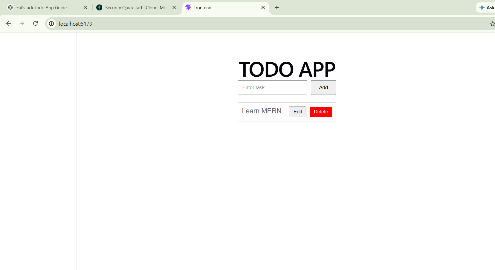
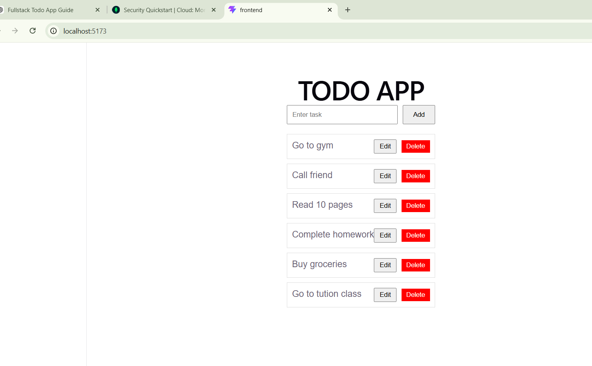
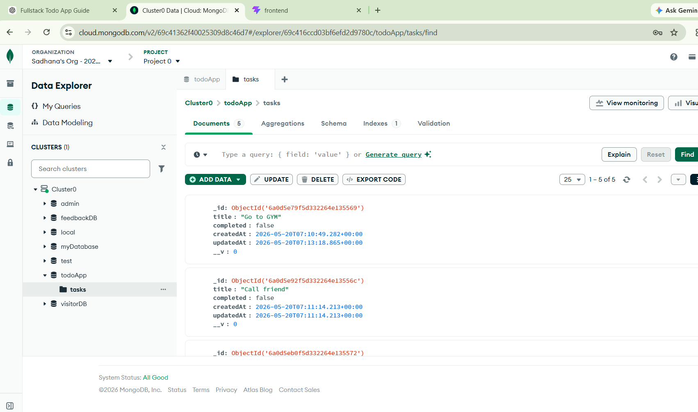

# Todo App (Full Stack)

## 🚀 About the Project
This is a full-stack Todo application built using React for frontend and Node.js, Express, MongoDB for backend.

Users can:
- Add todos
- Delete todos
- Update todos
- Mark todos as completed

---

## 🛠️ Tech Stack
Frontend: React, CSS, Axios  
Backend: Node.js, Express.js  
Database: MongoDB  

---

## 📁 Project Structure
frontend/  
backend/  

---

## ⚙️ Installation & Setup

### 1. Clone the repository
git clone https://github.com/landgekarsadhana-sys/todo-app.git

### 2. Backend setup
cd backend  
npm install  
npm start  

### 3. Frontend setup
cd frontend  
npm install  
npm start  

---

## 🔑 Environment Variables

Create a .env file inside backend folder:

PORT=5000  
MONGO_URI=your_mongodb_connection_string  

---

## ▶️ Run Project

Frontend runs on: http://localhost:3000  
Backend runs on: http://localhost:5000  

---

## ⭐ Features
- Full CRUD operations  
- REST API integration  
- MongoDB database connection  
- Responsive UI  

---

## 📸 Screenshots

### Home Page

  

---

### Tasks Page

  

### MongoDB Database

## 👨‍💻 Author
Your Name  
GitHub: https://github.com/landgekarsadhana-sys/todo-app  
LinkedIn: https://www.linkedin.com/in/sadhana-landgekar-7432213a2  

---

## ⭐ If you like this project
Give it a star ⭐ on GitHub